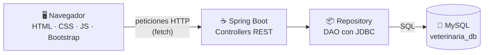
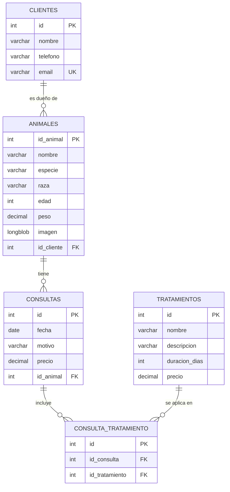
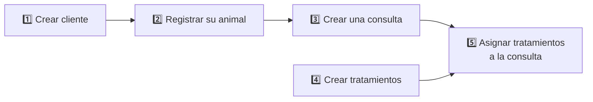

<div align="center">

# 🐾 VetApp

**Aplicación web para gestionar una clínica veterinaria**

Clientes, animales, consultas y tratamientos en un solo panel.


<!-- CAPTURA PRINCIPAL: guarda una imagen del Dashboard en docs/dashboard.png y descomenta la línea de abajo -->
<!--  -->

</div>

---

## 📋 Índice

- [Sobre el proyecto](#-sobre-el-proyecto)
- [Funcionalidades](#-funcionalidades)
<!-- - [Capturas](#-capturas) -->
- [Cómo funciona](#-cómo-funciona)
- [Instalación](#-instalación)
- [Guía de uso](#-guía-de-uso)
- [API REST](#-api-rest)
- [Autor](#-autor)

---

## 📖 Sobre el proyecto

VetApp permite a una clínica veterinaria llevar el registro de sus clientes, los animales de cada cliente, las consultas que se realizan y los tratamientos aplicados en cada consulta.

Proyecto desarrollado de forma individual durante el ciclo de **Desarrollo de Aplicaciones Multiplataforma (DAM)**.

---

## ✨ Funcionalidades

| | Módulo | Qué permite hacer |
| :---: | --- | --- |
| 📊 | **Dashboard** | Ver de un vistazo el total de clientes, animales, consultas y tratamientos |
| 👤 | **Clientes** | Crear, editar y eliminar clientes. Importar y exportar en CSV |
| 🐶 | **Animales** | Registrar animales con foto y asignarlos a su dueño. Importar y exportar en CSV |
| 🩺 | **Consultas** | Registrar visitas con fecha, motivo, precio y animal atendido |
| 💊 | **Tratamientos** | Gestionar el catálogo de tratamientos con descripción, duración y precio |
| 🔗 | **Tratamientos por consulta** | Asignar y quitar tratamientos a cada consulta |

---

<!--
  CAPTURAS OCULTAS: cuando tengas las imágenes en la carpeta docs/, borra la
  apertura de este comentario (con estas tres líneas) y su cierre, al final de
  la sección. Haz lo mismo con el comentario de la línea Capturas del índice.

## 📸 Capturas

| Dashboard | Animales |
| :---: | :---: |
|  |  |

| Consultas | Tratamientos de una consulta |
| :---: | :---: |
|  |  |

---

-->

## 🧩 Cómo funciona

### Arquitectura



El frontend es una página única que llama a la API REST con `fetch`. Los controladores reciben las peticiones y usan los DAO para leer y escribir en MySQL.

### Base de datos



### Estructura del proyecto

```
VetApp/
├── schema.sql                  # Script para crear la base de datos
├── pom.xml                     # Dependencias (Maven)
└── src/main/
    ├── java/com/example/veterinariaapp/
    │   ├── controller/         # Endpoints de la API REST
    │   ├── model/              # Clientes, Animales, Consultas, Tratamientos
    │   └── repository/         # Acceso a la base de datos (DAO con JDBC)
    └── resources/
        ├── static/             # Interfaz web (index.html, app.js, app.css)
        └── application.properties
```

---

## 🚀 Instalación

**Requisitos:** Java 17, MySQL 8 y conexión a internet (Bootstrap se carga desde CDN).

**1. Clona el repositorio**
```bash
git clone https://github.com/davidtole-ss/VetApp.git
cd VetApp
```

**2. Crea la base de datos**

Abre `schema.sql` en MySQL Workbench y ejecútalo, o usa la terminal:
```bash
mysql -u root -p < schema.sql
```
> ⚠️ El script borra las tablas si ya existen. No lo ejecutes sobre una base de datos con datos que quieras conservar.

**3. Configura la conexión** en `src/main/resources/application.properties`:
```properties
spring.datasource.url=jdbc:mysql://localhost:3306/veterinaria_db
spring.datasource.username=root
spring.datasource.password=tu_contraseña
```

**4. Arranca la aplicación**
```bash
# Windows
mvnw.cmd spring-boot:run

# Linux / Mac
chmod +x mvnw
./mvnw spring-boot:run
```

**5. Abre** 👉 [http://localhost:8080](http://localhost:8080)

---

## 🧭 Guía de uso

Navega entre secciones con el **menú lateral**. Para empezar con la clínica vacía, sigue este orden, porque unos registros dependen de otros:



**1. Crea un cliente.** En *Clientes*, pulsa **+ Nuevo cliente** y rellena nombre, teléfono y email. El email no se puede repetir.

**2. Registra su animal.** En *Animales*, pulsa **+ Nuevo animal**, elige el propietario en el desplegable y, si quieres, sube una foto.

**3. Crea una consulta.** En *Consultas*, pulsa **+ Nueva consulta** e indica fecha, motivo, precio y el animal atendido.

**4. Crea los tratamientos.** En *Tratamientos*, pulsa **+ Nuevo tratamiento** e indica nombre, descripción, duración y precio.

**5. Asigna tratamientos a la consulta.** En *Consultas*, pulsa el botón **Tratamientos** de la consulta para añadir o quitar los que se aplicaron.

Cada fila tiene botones de **Editar** y **Eliminar**.

> ⚠️ **Borrado en cascada:** al eliminar un cliente se eliminan también sus animales, las consultas de esos animales y sus tratamientos asignados.

### Importar datos desde CSV

En *Clientes* y *Animales*, el botón **⬆ Importar CSV** carga varios registros a la vez. La primera línea del archivo es la cabecera y se ignora.

**Clientes**
```csv
nombre,telefono,email
Ana López,600111222,ana@email.com
Luis Martín,600333444,luis@email.com
```

**Animales** (el cliente indicado en `id_cliente` debe existir antes)
```csv
nombre,especie,raza,edad,peso,id_cliente
Toby,Perro,Beagle,4,12.5,1
Misi,Gato,Común europeo,2,4.1,2
```

Ten en cuenta al importar:
- Los valores no pueden contener comas.
- En animales, `edad` y `peso` deben ser números (el peso con punto decimal: `12.5`).
- Las fotos de los animales no se importan por CSV; se suben desde el formulario.
- Las filas con errores se saltan y al terminar se muestra cuántas se importaron.

Con **⬇ Exportar CSV** descargas los datos actuales. El archivo exportado incluye además la columna `id` al principio, así que para volver a importarlo hay que quitar esa columna.

---

## 🔌 API REST

<details>
<summary><b>Ver todos los endpoints</b></summary>

<br>

| Recurso | Método | Endpoint | Descripción |
| --- | :---: | --- | --- |
| Clientes | `GET` | `/clientes` | Listar clientes |
| | `POST` | `/clientes` | Crear cliente |
| | `PUT` | `/clientes` | Modificar cliente |
| | `DELETE` | `/clientes/{id}` | Eliminar cliente |
| Animales | `GET` | `/animales` | Listar animales |
| | `GET` | `/animales/{id}/imagen` | Obtener la foto de un animal |
| | `POST` | `/animales` | Crear animal (multipart, imagen opcional) |
| | `PUT` | `/animales` | Modificar animal (multipart, imagen opcional) |
| | `DELETE` | `/animales/{id}` | Eliminar animal |
| Consultas | `GET` | `/consultas` | Listar consultas |
| | `POST` | `/consultas` | Crear consulta |
| | `PUT` | `/consultas` | Modificar consulta |
| | `DELETE` | `/consultas/{id}` | Eliminar consulta |
| Tratamientos | `GET` | `/tratamientos` | Listar tratamientos |
| | `POST` | `/tratamientos` | Crear tratamiento |
| | `PUT` | `/tratamientos` | Modificar tratamiento |
| | `DELETE` | `/tratamientos/{id}` | Eliminar tratamiento |
| Tratamientos de consulta | `GET` | `/consulta-tratamiento/{idConsulta}` | Ver tratamientos de una consulta |
| | `POST` | `/consulta-tratamiento/{idConsulta}/{idTratamiento}` | Asignar tratamiento |
| | `DELETE` | `/consulta-tratamiento/{idConsulta}/{idTratamiento}` | Quitar tratamiento |
| CSV | `POST` | `/csv/clientes/importar` | Importar clientes |
| | `GET` | `/csv/clientes/exportar` | Exportar clientes |
| | `POST` | `/csv/animales/importar` | Importar animales |
| | `GET` | `/csv/animales/exportar` | Exportar animales |

</details>

---

## 👨‍💻 Autor

**David Sorin Tole**
Estudiante de Desarrollo de Aplicaciones Multiplataforma

[](https://github.com/davidtole-ss)
